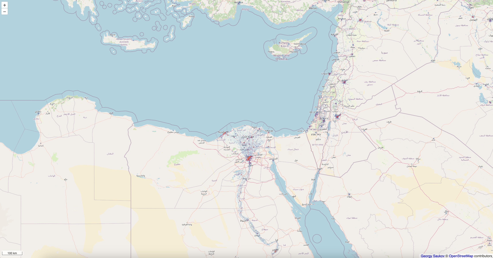

# Global Human Settlement Layer - Human Density layer client

#### 3ss resolution sample:

#### 30ss resolution sample:

#### 90ss resolution sample layer:

### Data origin and license:
[human-settlement.emergency.copernicus.eu](https://human-settlement.emergency.copernicus.eu/download.php?ds=pop)  

### Useful links:
https://www.maptiler.com/google-maps-coordinates-tile-bounds-projection/#9/-178.76/67.10  
https://enonline.supermap.com/iServer9D/Subject_introduce/Cache/MapCache/TileFormat/ZXY_format.htm  
https://openlayers.org/en/latest/examples/sea-level.html  
https://stackoverflow.com/questions/57319221/how-to-create-custom-tiles-that-fit-on-a-certain-extent-openlayers5  
https://gis.stackexchange.com/questions/344604/openlayers-smoothly-change-tile-source-on-zoom  
https://gis.stackexchange.com/questions/234039/min-max-zoom-levels-for-a-tilelayer  
LAZY loading: https://stackoverflow.com/questions/77428955/openlayer-on-zooming-map-image-filter-get-only-visible-areas-on-map  
